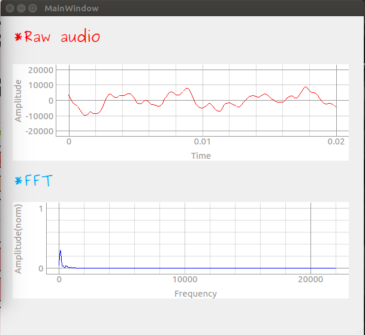
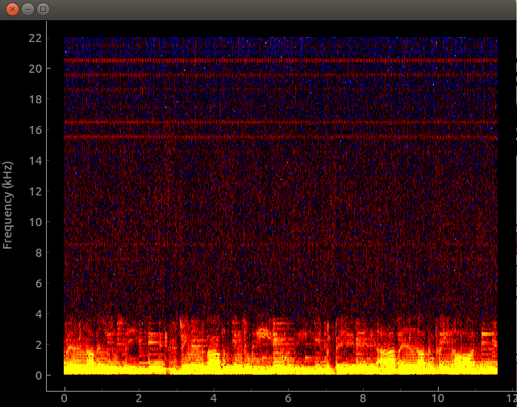
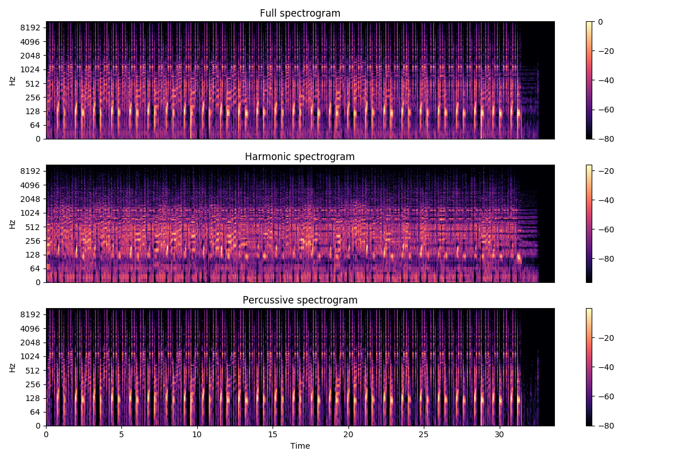
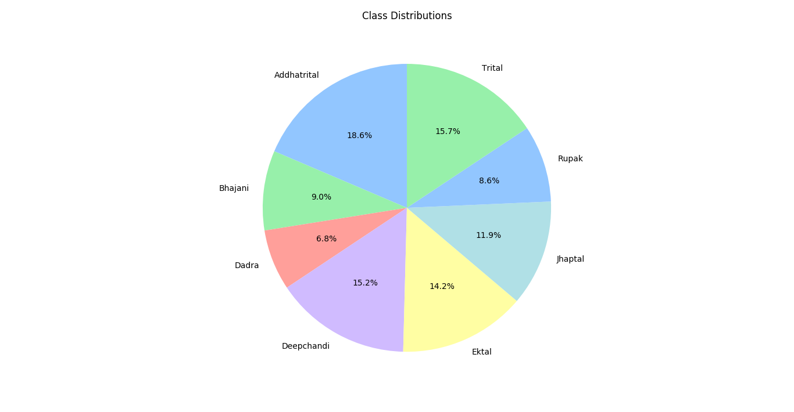
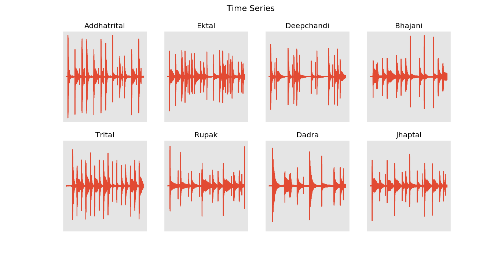
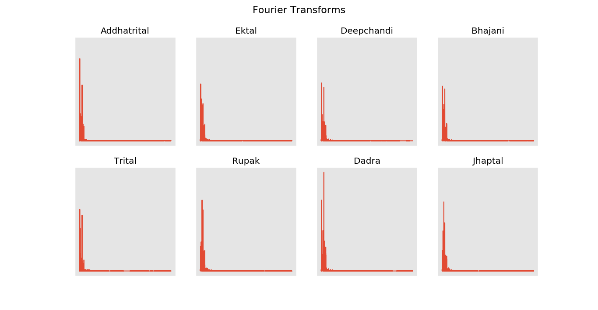
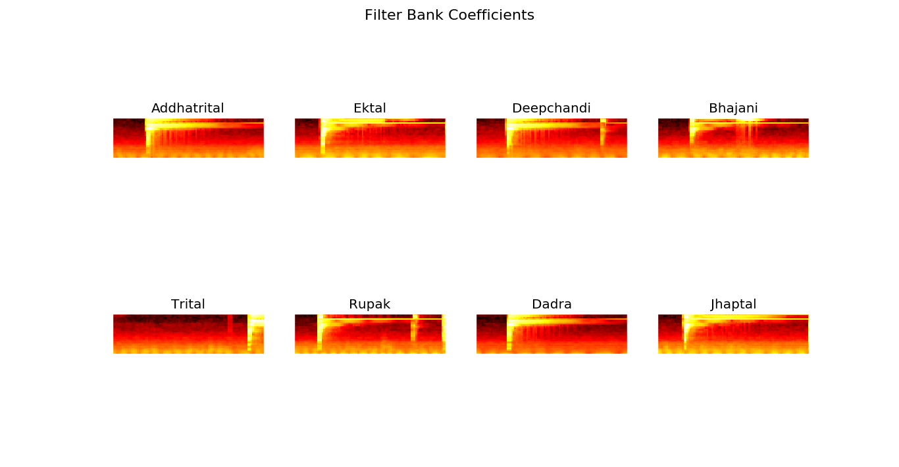
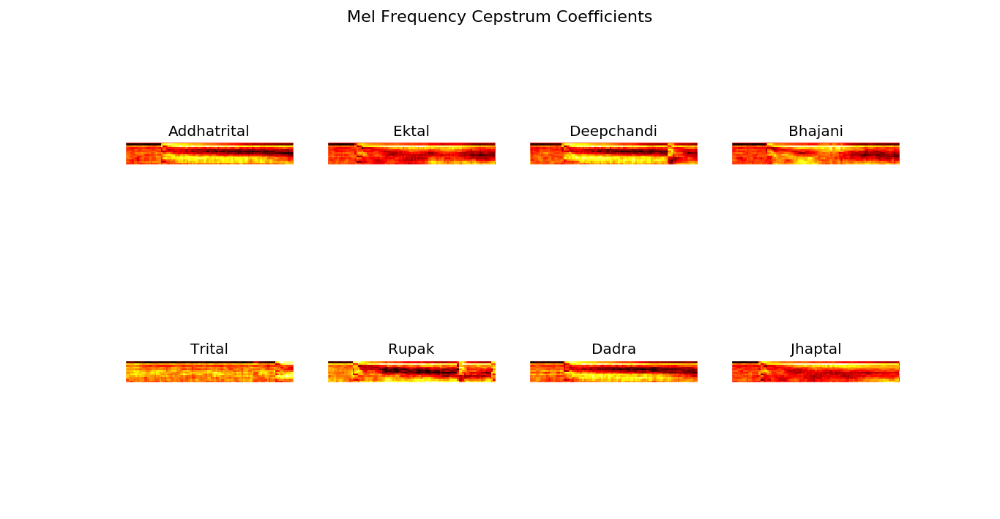
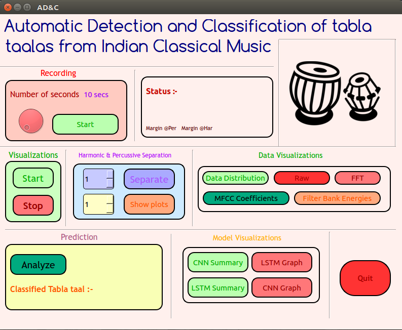

## Automatic Detection and classification of tabla talas from the Indian Classical music

---

## Introduction

This project work aims on developing a system that would be able to first detect a <a href="https://en.wikipedia.org/wiki/Tabla">tabla</a> <a href="https://en.wikipedia.org/wiki/Tala_(music)">tala</a>
from a mix(a song) of an Indian or Carnatic Classical Music and then classify the tala. Tala is specific pattern which occurs in all of the Indian Classical Music and Tabla is percussive accompanying instrument.

---

## Motivation

The work done by people around the world from the Music Information Retrieval<a href="https://en.wikipedia.org/wiki/Music_information_retrieval">(MIR)</a> community revolves around the western music, their genres and their instruments, but no significant work has been carried around Indian Classical Music and specifically tabla. The main objective of the project was to make the system real-time. The attempt on making the system real-time has not been done so far. Also, this could be the starting point to study the several prospects of the Indian Classical Music. To the best of our knowledge, there have been only few attempts on tala classification using Deep Learning and making it real-time. Also, the attempts made in bol transcription use the classical machine learning techniques which may not be able to make classification robust.

---

### Methods used

1. Models
  * Convolutional Neural Network 
  * Long Short-Term Memory Network
  
2. Signal Processing
  * Downsampling (from 44100 to 16000)
  * Noise Threshold Detection (Using envelope detection)
  * Harmonic-Percussive Source Separation [HPSS](https://librosa.github.io/librosa/auto_examples/plot_hprss.html)
  
  ---
  
  
### File description 

1. `PNstreamsetup.py` - Audio backend for live audio and FFT.
2. `GUI.py` - QtDesigner generated code converted to Python using `pyuic`
3. `Vocalseparation.py` - Implementation of vocal separation as shown [here](https://librosa.github.io/librosa/auto_examples/plot_vocal_separation.html).
4. `dataops.py` - Perform pre-processing on data.
5. `model.py` - Models and pickles form here.
6. `predict.py` - Predict on a sample using this.
7. `main.py` - Real-time visualisations, recording and classification

---

### Getting Started

1. Clone this repository `git clone https://github.com/pranav6670/Detection-Classification-of-Tabla-taals.git`.

2. Data is stored in `wavfiles` diectory. Check-out the data. There are 10 classes of [talas](https://en.wikipedia.org/wiki/Tala_(music)). A `test.csv` is included in the directory 

3. First run the `dataops.py` script which will pre-process the data which includes, first, downsampling the data and then cleaning it(noise threshold detection).

4. Then create two folders named `models` and `pickles` into the directory.

5. Run `model.py` to form pickles out of the data and start training. The `cfg.py` can be used to adjust the parameters of MFCC function. `In model.py`, `config.mode == 'conv'` will select the CNN model while `config.mode == 'rec'` will select the LSTM model. The difference between these is only the shape of input data to the model. Once pickles are formed for both the models, the data dosen't load again the next time, saving alot of time. The models are easy to modify.

6. Under `models` directory, you will find the `conv.model` and `rec.model` formed, after training. Use these models to predict using `predict.py`

7. Also run `main.py` after training to do the classification real-time.

---

### Tools used for real-time visuals

* Raw and FFT plot

 

* Spectogram

 

---

### HPSS

 

---

### Data Distribution

 

---

### Features

| Time(Raw)  | FFT     | 
|------------|---------| 
|    |   |

| Filter Bank Energies  | MFCC    | 
|------------|---------- | 
|    |     |

---

### GUI

Made using PyQt5

 

---

  
  
